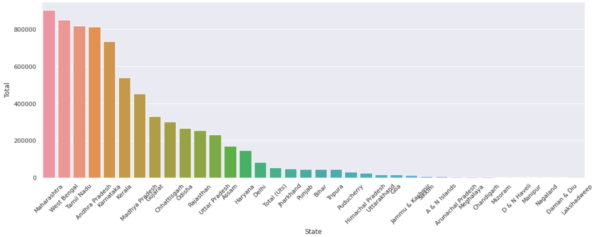

# Mini-Project
## CODE
```
import pandas as pd
import numpy as np
df=pd.read_csv("Suicides in India 2001-2012.csv")
df.head()
df.replace('A & N Islands (Ut)', 'A & N Islands', inplace=True)
df.replace('Chandigarh (Ut)', 'Chandigarh', inplace=True)
df.replace('D & N Haveli (Ut)', 'D & N Haveli',inplace=True)
df.replace('Daman & Diu (Ut)', 'Daman & Diu',inplace=True)
df.replace('Lakshadweep (Ut)','Lakshadweep',inplace=True)
df.replace('Delhi (Ut)','Delhi',inplace=True)
df.replace('Bankrupty or Sudden change in Economic','Bankruptcy or Sudden change in Economic Status',inplace=True)
df.replace('By Other means (please specify)','By Other means',inplace=True)
df.replace('Not having Children(Barrenness/Impotency','Not having Children (Barrenness/Impotency)',inplace=True)
df=df.drop(df[(df.State=='Total(Uts)')|(df.State=='Total (All India)')|(df.State=='Total (States)')].index)
import seaborn as sns
sns.set(rc={'figure.figsize':(11.7,8.27)})
sns.barplot(x=df['Gender'],y=df['Total'])
grp=df.groupby('State')['Total'].sum()
total_suicides=pd.DataFrame(grp).reset_index().sort_values('Total',ascending=False)
import matplotlib.pyplot as plt
fig, ax=plt.subplots(figsize=(18,6))
g=sns.barplot(x='State',y='Total',data=total_suicides)
g.set_xticklabels(g.get_xticklabels(),rotation=45)
grp_yr =df.groupby('Year')['Total'].sum()
year=pd.DataFrame(grp_yr).reset_index().sort_values('Year',ascending=False)
g=sns.barplot(x='Year',y='Total',data=year,palette='flare')
import seaborn as sns
sns.set(rc={'figure.figsize':(11.7,8.27)})
sns.countplot(df['Type_code'])
df_by_code = df[df['Type_code'] == 'Social_Status']
df_by_code['Type'].unique()
df_by_social = df_by_code.groupby('Type')['Total'].sum()
df_by_social_type = pd.DataFrame(df_by_social).reset_index().sort_values('Total')
print('Total people who have their social status mentioned in the data {}'.format(df_by_code.shape[0]))
labels = df_by_social_type['Type']
explode = (0,0,0,0,0.1)
plt.pie(df_by_social_type['Total'],labels = labels,autopct='%1.1f%%',explode = explode,shadow=True)
plt.show()
df_by_code = df[df['Type_code'] == 'Professional_Profile']
df_by_code['Type'].unique()
df_by_proffession = df_by_code.groupby('Type')['Total'].sum()
df_by_proffession_type = pd.DataFrame(df_by_proffession).reset_index().sort_values('Total')

print('Total people who have their professional mentioned in the data {}'.format(df_by_code.shape[0]))
sns.barplot(x = df_by_proffession_type['Total'], y = df_by_proffession_type['Type'])
df_by_code = df[df['Type_code'] == 'Means_adopted']
df_by_code['Type'].unique()
df_by_means = df_by_code.groupby('Type')['Total'].sum()
df_by_means_type = pd.DataFrame(df_by_means).reset_index().sort_values('Total')
fig , ax = plt.subplots(figsize=(18,6))
g = sns.barplot(x = df_by_means_type['Total'], y = df_by_means_type['Type'])
df_by_code = df[df['Type_code'] == 'Education_Status']
df_by_code['Type'].unique()
df_by_education = df_by_code.groupby('Type')['Total'].sum()
df_by_education_type = pd.DataFrame(df_by_education).reset_index().sort_values('Total')
#print('Total people who have their social status mentioned in the data {}'.format(df_by_code.shape[0]))
labels = df_by_education_type['Type']

plt.pie(df_by_education_type['Total'],labels = labels,autopct='%1.1f%%')
plt.show()
df_by_code = df[df['Type_code'] == 'Causes']
df_by_code['Type'].unique()
df_by_causes = df_by_code.groupby('Type')['Total'].sum()
df_by_causes_type = pd.DataFrame(df_by_causes).reset_index().sort_values('Total')
fig , ax = plt.subplots(figsize=(18,20))
g = sns.barplot(x = df_by_causes_type['Total'], y = df_by_causes_type['Type'])
```
## OUTPUT





